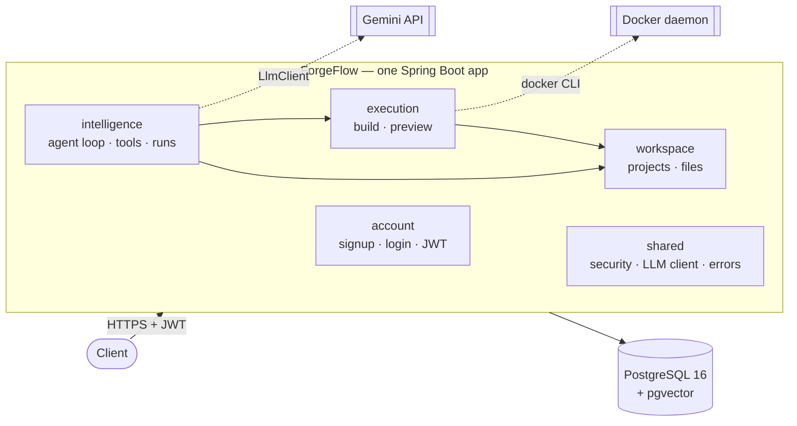
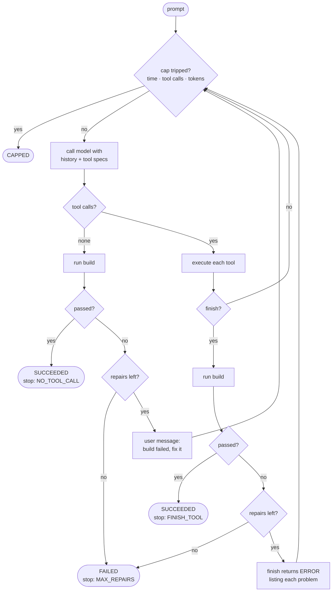
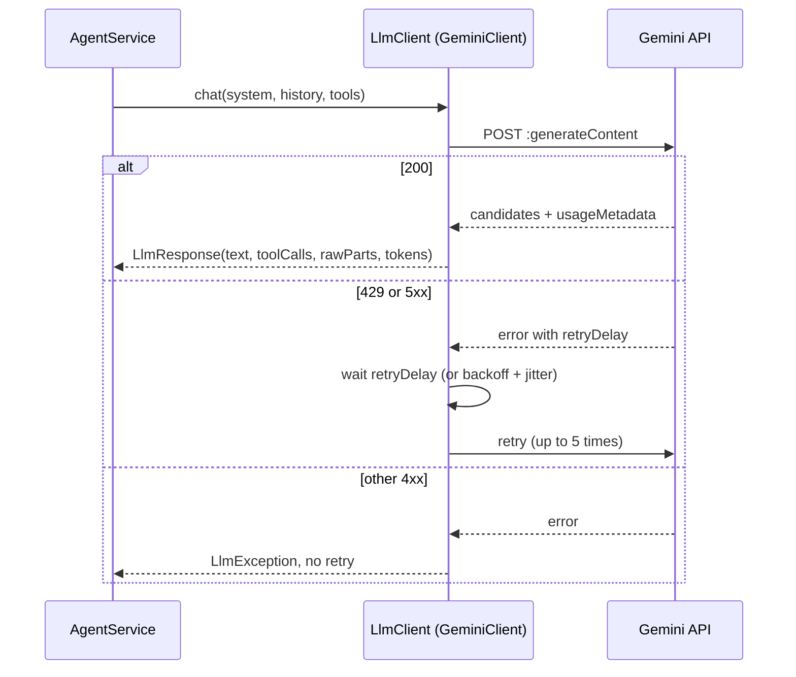
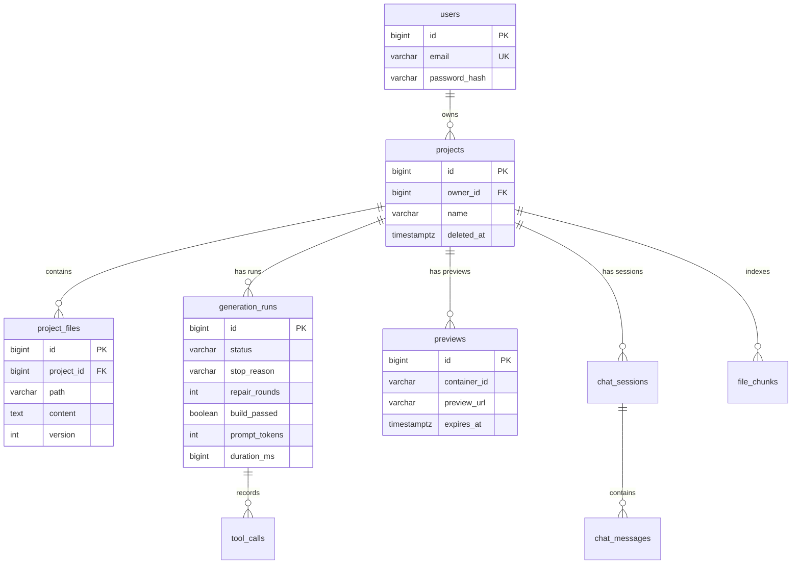

# ForgeFlow — Architecture

**Version:** 0.2 — 22 Sep 2026
**Status:** agent loop, streaming, sandbox and self-healing built and verified
**Author:** Aman Raj Verma

| Version | Date | Change |
|---|---|---|
| 0.1 | 10 Sep 2026 | Initial design — the plan |
| 0.2 | 22 Sep 2026 | Rewritten to match what was built. Spring AI dropped for a direct client; Boot 4.1.1; Gemini; sandbox and build gate as built. See §11 for every deviation from 0.1. |

---

## 1. What ForgeFlow is

Describe an app in plain English and get a working, running app back — then
refine it by conversation.

```
"build me a recipe site with search"
      │
      ▼
agent plans → writes files → calls finish → build check
      │                                        │
      │                              fails? ◄──┘  errors go back to the agent,
      │                                           it fixes them, finish again
      ▼
preview URL · file tree · every step streamed live
```

The product is the loop. Everything else is plumbing around it.

---

## 2. Principles

| # | Principle | In practice |
|---|---|---|
| P1 | **Defensible over impressive** | Nothing ships that can't be explained line by line |
| P2 | **The loop is the product** | Auth and CRUD are support acts; the agent gets the time |
| P3 | **Measure, don't claim** | Tokens, durations, repair rounds recorded on every run |
| P4 | **Untrusted by default** | Model-written paths and code are hostile until checked |
| P5 | **Cut depth, not correctness** | Fewer features, each one actually finished |

---

## 3. Stack

| Layer | Choice | Note |
|---|---|---|
| Runtime | Java 21, Spring Boot **4.1.1** | Spring Framework 7, Security 7, Tomcat 11 |
| JSON | **Jackson 3** | package `tools.jackson`, not `com.fasterxml.jackson` |
| Database | PostgreSQL 16 + pgvector | `pgvector/pgvector:pg16`, host port **5433** |
| Migrations | Flyway | `ddl-auto: validate` — Flyway owns the schema |
| Auth | BCrypt + JWT (jjwt 0.13.0) | stateless |
| Model | Google **Gemini 2.5 Flash** | free tier, 5 requests/min |
| Model client | JDK `java.net.http.HttpClient` | **no Spring AI** — see §11 |
| Sandbox | Docker CLI via `ProcessBuilder` | `node:20-alpine` build, `nginx:alpine` preview |
| App port | **8081** | 8080 and 5432 belong to Transakt |

---

## 4. Shape: a modular monolith

One deployable application, with packages drawn where separate services would be.



**Rules that keep a later split cheap:**
- Modules call each other through **service interfaces**, never another module's
  repository
- **No cross-module JPA relationships** — reference by ID (`Project.ownerId` is a `Long`)
- Each module owns its tables

**Known exception:** `AgentTools` (intelligence) reads `ProjectFileRepository`
(workspace) directly. `ProjectFileService` exists; `AgentTools` should move to it.

**Why not microservices yet:** six services means six deployments and
distributed debugging before the product works. The only boundary that earns a
network hop in v1 is `execution`, because it runs untrusted code and scales on a
different curve. It will be the first split.

### Package map

```
com.forgeflow
├── ForgeflowApplication
├── account/        User, UserRepository, AuthService, AuthController, dto/
├── workspace/      Project, ProjectService, ProjectController,
│                   ProjectFile, ProjectFileRepository, ProjectFileService,
│                   FileController, dto/
├── intelligence/   AgentService, AgentTools, AgentPrompt, AgentEvent,
│                   AgentController, GenerationRun, GenerationRunRepository, dto/
├── execution/      SandboxProvider, DockerSandboxProvider, BuildResult,
│                   PreviewHandle, Preview, PreviewRepository,
│                   SandboxException, ExecutionController
└── shared/         GlobalExceptionHandler, ResourceNotFoundException
    ├── security/   JwtService, JwtAuthFilter, SecurityConfig, PasswordConfig
    └── llm/        LlmClient, GeminiClient, LlmMessage, LlmResponse,
                    ToolSpec, ToolCall, ToolResult, LlmException

resources/
├── application.yml
├── db/migration/V1__init.sql
└── sandbox/check.js
```

---

## 5. The agent loop



### 5.1 Tools

| Tool | Does |
|---|---|
| `list_files` | file tree with sizes |
| `read_file` | one file's content |
| `write_file` | create or fully replace a file |
| `finish` | ends the run — **only if the build passes** |

There is no command-execution tool. The allowlist is the security boundary.

A rejected call returns `ERROR: reason` as the tool result rather than throwing,
so the model can read it and adjust.

### 5.2 The build gate

The build runs **inside `finish`**. Consequences:
- The model cannot skip verification — the only way out goes through it
- A failing build arrives as a tool result, which the model acts on well
- No two user turns in a row, which Gemini can reject

The `NO_TOOL_CALL` path is verified too — stopping without calling `finish`
still runs the build.

### 5.3 Caps

| Cap | Default | Config key |
|---|---|---|
| Tool calls per run | 25 | `forgeflow.agent.max-tool-calls` |
| Input tokens per run | 120,000 | `forgeflow.agent.max-input-tokens` |
| Wall clock | 240 s | `forgeflow.agent.timeout-seconds` |
| Repair rounds | 3 | `forgeflow.agent.max-repair-rounds` |

240s because the free tier's rate limit stretches runs: a one-repair run took
114s. On a paid key the same run is roughly 20s.

### 5.4 Status and stop reason

- **`status`** — the outcome: `SUCCEEDED` (build passed) · `CAPPED` · `FAILED`
- **`stop_reason`** — the mechanism: `FINISH_TOOL` · `NO_TOOL_CALL` ·
  `MAX_REPAIRS` · `MAX_TOOL_CALLS` · `TOKEN_BUDGET` · `TIMEOUT` · `ERROR`

Kept separate so a success that ended untidily stays visible to the eval harness.

---

## 6. The model client



- **`LlmClient`** — one method; provider-neutral. A second provider is one more class.
- **Model turns echoed verbatim.** Gemini attaches a `thoughtSignature` to each
  part; `LlmMessage.rawModelParts` carries it back so the model keeps its reasoning.
- **Token accounting uses the API's `totalTokenCount`**, which includes thinking
  tokens that prompt + completion miss.
- **Retries:** 429 and 5xx only. Honours the server's `retryDelay`; falls back to
  exponential backoff (2s base) with 0–500ms jitter.

---

## 7. Streaming

`POST /api/v1/projects/{id}/generate/stream` returns `text/event-stream`.

| Event | Sent when |
|---|---|
| `status` | "Planning", "Building" |
| `thinking` | a new round starts |
| `tool` | a tool is called |
| `file` | a file is written |
| `tool_failed` | a tool call is rejected |
| `build` | a build finishes — passed or failed, with output |
| `repair` | a repair round starts |
| `done` | run over — carries the full result |
| `error` | the run threw |

- **Our events, not model tokens** — a tool call arrives from Gemini as one
  complete chunk, so a completed tool call is the unit of progress.
- **Ownership checked on the request thread** before the emitter exists, so an
  unauthorised caller gets a real 404.
- **Virtual-thread executor** — a run is mostly waiting on the network.
- **A throwing listener can't kill the run.**

---

## 8. The sandbox

```java
interface SandboxProvider {
    BuildResult   build(Long projectId, Map<String, String> files);
    PreviewHandle startPreview(Long projectId, Map<String, String> files);
    void          stopPreview(Long projectId);
}
```

v1: `DockerSandboxProvider`. Phase 2: a Kubernetes provider. The interface exists
because the security model differs per backend.

### 8.1 Two containers, two threat models

| | Build | Preview |
|---|---|---|
| Handles generated code | yes — parses it | no — only serves bytes |
| Network | `--network=none` | port bound to `127.0.0.1` only |
| Filesystem | `--read-only`, tmpfs `/tmp` | `--read-only`, tmpfs for nginx |
| User | `1000:1000`, not root | image default |
| Capabilities | `--cap-drop=ALL` + `no-new-privileges` | default |
| Limits | 0.5 CPU · 512MB · 128 PIDs · 30s | 0.25 CPU · 128MB · 64 PIDs |
| `--rm` | yes | **no** — keep logs if startup fails |

The generated JavaScript runs in the *viewer's browser*, under the browser's own
sandbox — which is why the preview container can be lighter.

### 8.2 The check

`sandbox/check.js`, run inside the build container:
1. `index.html` must exist
2. every `.js` file must parse — `vm.Script` compiles without executing
3. every local `src=` / `href=` in HTML must resolve to a real file

Failures are one per line, file name first — written for the model to read.

### 8.3 Hardening details

- **Second path guard.** `writeFiles` normalises each path and refuses anything
  outside the sandbox folder — independent of the guard in `AgentTools`.
- **Timeout kills the container, not just the CLI** — `docker rm -f` by name.
- **Output drained concurrently** and capped at 8KB, so a chatty process can't
  deadlock on a full pipe.
- **Work under `~/.forgeflow`**, because Docker Desktop on a Mac can only mount
  folders shared with its VM.

---

## 9. Data model



| Table | Used? | Notes |
|---|---|---|
| `users`, `projects`, `project_files` | ✅ | `UNIQUE(project_id, path)` on files |
| `generation_runs` | ✅ | observability, quota and eval output in one |
| `previews` | ✅ | `expires_at` recorded, not yet enforced |
| `tool_calls` | ⬜ | schema ready, not written |
| `chat_sessions`, `chat_messages` | ⬜ | runs don't carry conversation memory yet |
| `file_chunks` | ⬜ | `vector(768)` + `tsvector`, for RAG |

---

## 10. API

| Method | Path | Auth | Returns |
|---|---|---|---|
| GET | `/actuator/health` | open | status |
| POST | `/api/v1/auth/signup` | open | 201 + token |
| POST | `/api/v1/auth/login` | open | 200 + token |
| POST | `/api/v1/projects` | JWT | 201 + `Location` |
| GET | `/api/v1/projects` | JWT | caller's projects |
| GET / PUT / DELETE | `/api/v1/projects/{id}` | JWT | 404 if not yours |
| POST | `/api/v1/projects/{id}/generate` | JWT | run result (blocking) |
| POST | `/api/v1/projects/{id}/generate/stream` | JWT | SSE |
| GET | `/api/v1/projects/{id}/files` | JWT | file tree |
| GET | `/api/v1/projects/{id}/files/content?path=` | JWT | one file |
| POST | `/api/v1/projects/{id}/build` | JWT | `BuildResult` |
| POST | `/api/v1/projects/{id}/preview` | JWT | URL + expiry |
| DELETE | `/api/v1/projects/{id}/preview` | JWT | 204 |

**Security rules:** 401 for anonymous (explicit entry point); 404 not 403 for
others' resources; identical login failures; `ownerId` never read from requests;
`/error` permitted first.

---

## 11. Changes from v0.1

| v0.1 planned | Built | Why |
|---|---|---|
| Spring Boot 3.4.1 | **4.1.1** | Initializr no longer offered 3.4.1 |
| Spring AI + Anthropic | **Direct HTTP + Gemini** | Spring AI 2.x is milestone-only for Boot 4; Gemini has a free tier |
| Stream model output | **Stream our own events** | a tool call arrives as one chunk |
| docker-java library | **Docker CLI via `ProcessBuilder`** | no dependency to version-match |
| `run_build` tool | **build gate inside `finish`** | the model can't skip verification |
| `edit_file` tool | not yet | full rewrites only for now |
| Prompt caching | not yet | |
| Evals, RAG | not yet | |
| 90s timeout | **240s** | free-tier rate limits stretch runs |

---

## 12. Known gaps

- `AgentTools` bypasses `ProjectFileService` (module-boundary exception)
- `SandboxException` not mapped in `GlobalExceptionHandler` → default 500
- No preview reaper; `expires_at` recorded but not enforced
- `tool_calls`, `chat_*`, `file_chunks` unused; each run starts without memory
- `cost_usd`, `cached_tokens` always 0
- The timeout includes time spent waiting out rate limits
- No tests beyond the default; no CI; not deployed

---

## 13. Build status

| Day | Deliverable | Status |
|---|---|---|
| 1 | Skeleton, Postgres, Flyway | ✅ 11 Sep |
| 2 | Auth, projects, ownership | ✅ 12 Sep |
| 3 | **Agent loop + tools** | ✅ 14 Sep |
| 4 | SSE streaming | ✅ 18 Sep |
| — | Rate-limit retry | ✅ 22 Sep |
| 5 | **Docker sandbox** | ✅ 22 Sep |
| 6 | **Self-healing** | ✅ 22 Sep |
| 7 | `edit_file` + prompt caching | ⬜ |
| 8 | Evals | ⬜ |
| 9 | RAG | ⬜ first to cut |
| 10 | Deploy, README, CI | ⬜ |
