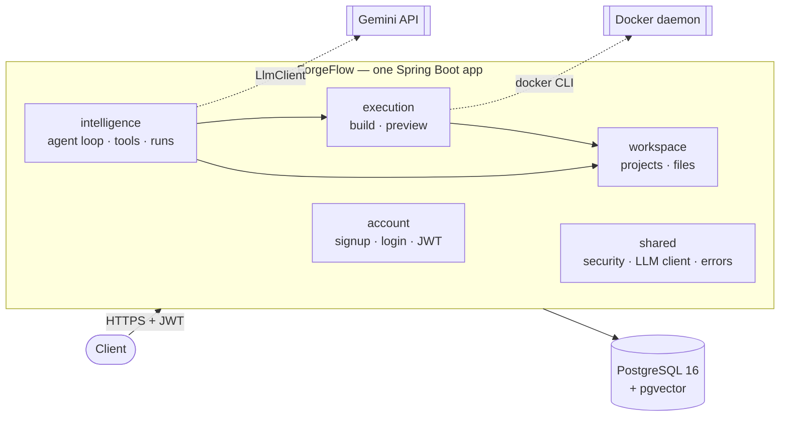
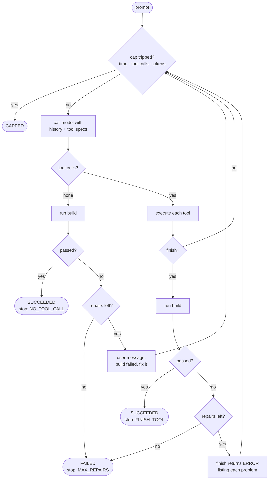
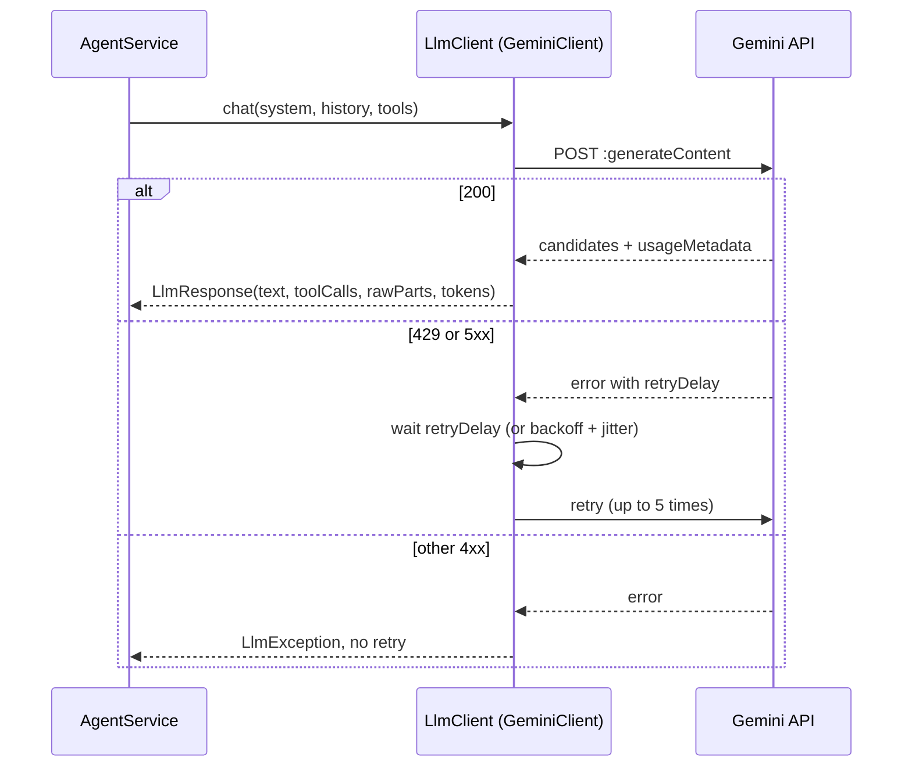
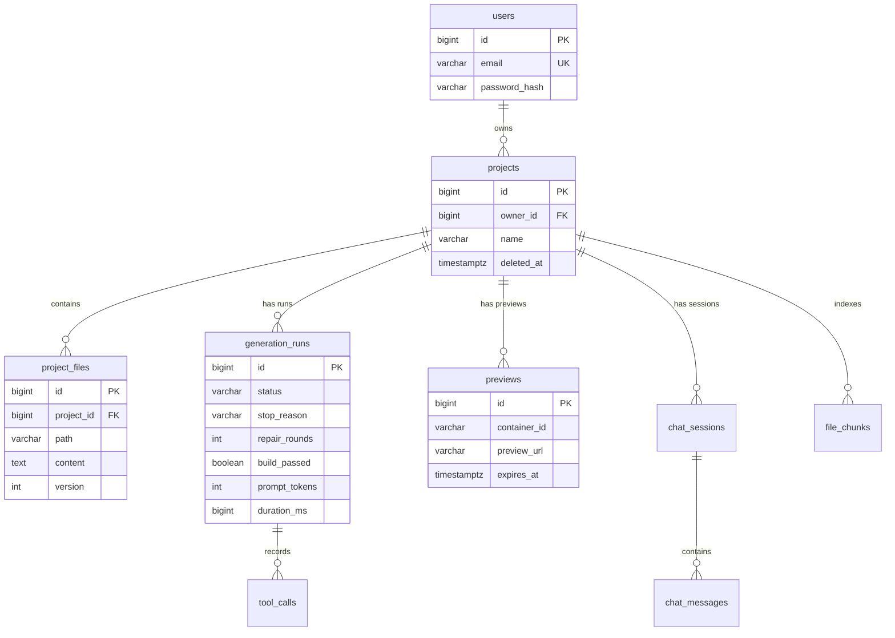

# ForgeFlow — Architecture

**Version:** 0.3 — 9 Oct 2026
**Status:** redesign to the Lovable-clone spec built, tested, and verified live on Render (§17)
**Author:** Aman Raj Verma

| Version | Date | Change |
|---|---|---|
| 0.1 | 10 Sep 2026 | Initial design — the plan |
| 0.2 | 22 Sep 2026 | Rewritten to match what was built. Spring AI dropped for a direct client; Boot 4.1.1; Gemini; sandbox and build gate as built. See §11 for every deviation from 0.1. |
| 0.3 | 9 Oct 2026 | Redesign to the Lovable-clone spec: members and roles, chat sessions with memory, zip download, logs stream, CI. §17 maps the spec onto the code. |

---

## 1. What ForgeFlow is

Describe an app in plain English and get a working, running app back — then
refine it by conversation.

```
"build me a recipe site with search"
      │
      ▼
agent plans → writes files → calls finish → build check
      │                                        │
      │                              fails? ◄──┘  errors go back to the agent,
      │                                           it fixes them, finish again
      ▼
preview URL · file tree · every step streamed live
```

The product is the loop. Everything else is plumbing around it.

---

## 2. Principles

| # | Principle | In practice |
|---|---|---|
| P1 | **Defensible over impressive** | Nothing ships that can't be explained line by line |
| P2 | **The loop is the product** | Auth and CRUD are support acts; the agent gets the time |
| P3 | **Measure, don't claim** | Tokens, durations, repair rounds recorded on every run |
| P4 | **Untrusted by default** | Model-written paths and code are hostile until checked |
| P5 | **Cut depth, not correctness** | Fewer features, each one actually finished |

---

## 3. Stack

| Layer | Choice | Note |
|---|---|---|
| Runtime | Java 21, Spring Boot **4.1.1** | Spring Framework 7, Security 7, Tomcat 11 |
| JSON | **Jackson 3** | package `tools.jackson`, not `com.fasterxml.jackson` |
| Database | PostgreSQL 16 + pgvector | `pgvector/pgvector:pg16`, host port **5433** |
| Migrations | Flyway | `ddl-auto: validate` — Flyway owns the schema |
| Auth | BCrypt + JWT (jjwt 0.13.0) | stateless |
| Model | Google **Gemini 2.5 Flash** | free tier, 5 requests/min |
| Model client | JDK `java.net.http.HttpClient` | **no Spring AI** — see §11 |
| Sandbox | Docker CLI via `ProcessBuilder` | `node:20-alpine` build, `nginx:alpine` preview |
| App port | **8081** | 8080 and 5432 belong to Transakt |

---

## 4. Shape: a modular monolith

One deployable application, with packages drawn where separate services would be.


```mermaid
flowchart LR
    Client([Client])

    subgraph App["ForgeFlow — one Spring Boot app"]
        direction TB
        Account["account<br/>signup · login · JWT"]
        Workspace["workspace<br/>projects · files"]
        Intelligence["intelligence<br/>agent loop · tools · runs"]
        Execution["execution<br/>build · preview"]
        Shared["shared<br/>security · LLM client · errors"]
    end

    DB[(PostgreSQL 16<br/>+ pgvector)]
    Gemini[[Gemini API]]
    Docker[[Docker daemon]]

    Client -->|HTTPS + JWT| App
    Intelligence --> Workspace
    Intelligence --> Execution
    Execution --> Workspace
    Intelligence -. LlmClient .-> Gemini
    Execution -. docker CLI .-> Docker
    App --> DB
```

**Rules that keep a later split cheap:**
- Modules call each other through **service interfaces**, never another module's
  repository
- **No cross-module JPA relationships** — reference by ID (`Project.ownerId` is a `Long`)
- Each module owns its tables

**Known exception:** `AgentTools` (intelligence) reads `ProjectFileRepository`
(workspace) directly. `ProjectFileService` exists; `AgentTools` should move to it.

**Why not microservices yet:** six services means six deployments and
distributed debugging before the product works. The only boundary that earns a
network hop in v1 is `execution`, because it runs untrusted code and scales on a
different curve. It will be the first split.

### Package map

```
com.forgeflow
├── ForgeflowApplication
├── account/        User, UserRepository, AuthService, AuthController, dto/
├── workspace/      Project, ProjectService, ProjectController,
│                   ProjectFile, ProjectFileRepository, ProjectFileService,
│                   FileController, dto/
├── intelligence/   AgentService, AgentTools, AgentPrompt, AgentEvent,
│                   AgentController, GenerationRun, GenerationRunRepository, dto/
├── execution/      SandboxProvider, DockerSandboxProvider, BuildResult,
│                   PreviewHandle, Preview, PreviewRepository,
│                   SandboxException, ExecutionController
└── shared/         GlobalExceptionHandler, ResourceNotFoundException
    ├── security/   JwtService, JwtAuthFilter, SecurityConfig, PasswordConfig
    └── llm/        LlmClient, GeminiClient, LlmMessage, LlmResponse,
                    ToolSpec, ToolCall, ToolResult, LlmException

resources/
├── application.yml
├── db/migration/V1__init.sql
└── sandbox/check.js
```

---

## 5. The agent loop


```mermaid
flowchart TD
    Start([prompt]) --> Caps{cap tripped?<br/>time · tool calls · tokens}
    Caps -- yes --> Capped([CAPPED])
    Caps -- no --> Model[call model with<br/>history + tool specs]
    Model --> Tools{tool calls?}

    Tools -- none --> Verify1[run build]
    Verify1 --> P1{passed?}
    P1 -- yes --> Done1([SUCCEEDED<br/>stop: NO_TOOL_CALL])
    P1 -- no --> Budget1{repairs left?}
    Budget1 -- no --> Failed([FAILED<br/>stop: MAX_REPAIRS])
    Budget1 -- yes --> Nudge[user message:<br/>build failed, fix it] --> Caps

    Tools -- yes --> Exec[execute each tool]
    Exec --> IsFinish{finish?}
    IsFinish -- no --> Caps
    IsFinish -- yes --> Verify2[run build]
    Verify2 --> P2{passed?}
    P2 -- yes --> Done2([SUCCEEDED<br/>stop: FINISH_TOOL])
    P2 -- no --> Budget2{repairs left?}
    Budget2 -- no --> Failed
    Budget2 -- yes --> Err[finish returns ERROR<br/>listing each problem] --> Caps
```

### 5.1 Tools

| Tool | Does |
|---|---|
| `list_files` | file tree with sizes |
| `read_file` | one file's content |
| `write_file` | create or fully replace a file |
| `finish` | ends the run — **only if the build passes** |

There is no command-execution tool. The allowlist is the security boundary.

A rejected call returns `ERROR: reason` as the tool result rather than throwing,
so the model can read it and adjust.

### 5.2 The build gate

The build runs **inside `finish`**. Consequences:
- The model cannot skip verification — the only way out goes through it
- A failing build arrives as a tool result, which the model acts on well
- No two user turns in a row, which Gemini can reject

The `NO_TOOL_CALL` path is verified too — stopping without calling `finish`
still runs the build.

### 5.3 Caps

| Cap | Default | Config key |
|---|---|---|
| Tool calls per run | 25 | `forgeflow.agent.max-tool-calls` |
| Input tokens per run | 120,000 | `forgeflow.agent.max-input-tokens` |
| Wall clock | 240 s | `forgeflow.agent.timeout-seconds` |
| Repair rounds | 3 | `forgeflow.agent.max-repair-rounds` |

240s because the free tier's rate limit stretches runs: a one-repair run took
114s. On a paid key the same run is roughly 20s.

### 5.4 Status and stop reason

- **`status`** — the outcome: `SUCCEEDED` (build passed) · `CAPPED` · `FAILED`
- **`stop_reason`** — the mechanism: `FINISH_TOOL` · `NO_TOOL_CALL` ·
  `MAX_REPAIRS` · `MAX_TOOL_CALLS` · `TOKEN_BUDGET` · `TIMEOUT` · `ERROR`

Kept separate so a success that ended untidily stays visible to the eval harness.

---

## 6. The model client


```mermaid
sequenceDiagram
    participant A as AgentService
    participant L as LlmClient (GeminiClient)
    participant G as Gemini API

    A->>L: chat(system, history, tools)
    L->>G: POST :generateContent
    alt 200
        G-->>L: candidates + usageMetadata
        L-->>A: LlmResponse(text, toolCalls, rawParts, tokens)
    else 429 or 5xx
        G-->>L: error with retryDelay
        L->>L: wait retryDelay (or backoff + jitter)
        L->>G: retry (up to 5 times)
    else other 4xx
        G-->>L: error
        L-->>A: LlmException, no retry
    end
```

- **`LlmClient`** — one method; provider-neutral. A second provider is one more class.
- **Model turns echoed verbatim.** Gemini attaches a `thoughtSignature` to each
  part; `LlmMessage.rawModelParts` carries it back so the model keeps its reasoning.
- **Token accounting uses the API's `totalTokenCount`**, which includes thinking
  tokens that prompt + completion miss.
- **Retries:** 429 and 5xx only. Honours the server's `retryDelay`; falls back to
  exponential backoff (2s base) with 0–500ms jitter.

---

## 7. Streaming

`POST /api/v1/projects/{id}/generate/stream` returns `text/event-stream`.

| Event | Sent when |
|---|---|
| `status` | "Planning", "Building" |
| `thinking` | a new round starts |
| `tool` | a tool is called |
| `file` | a file is written |
| `tool_failed` | a tool call is rejected |
| `build` | a build finishes — passed or failed, with output |
| `repair` | a repair round starts |
| `done` | run over — carries the full result |
| `error` | the run threw |

- **Our events, not model tokens** — a tool call arrives from Gemini as one
  complete chunk, so a completed tool call is the unit of progress.
- **Ownership checked on the request thread** before the emitter exists, so an
  unauthorised caller gets a real 404.
- **Virtual-thread executor** — a run is mostly waiting on the network.
- **A throwing listener can't kill the run.**

---

## 8. The sandbox

```java
interface SandboxProvider {
    BuildResult   build(Long projectId, Map<String, String> files);
    PreviewHandle startPreview(Long projectId, Map<String, String> files);
    void          stopPreview(Long projectId);
}
```

v1: `DockerSandboxProvider`. Phase 2: a Kubernetes provider. The interface exists
because the security model differs per backend.

### 8.1 Two containers, two threat models

| | Build | Preview |
|---|---|---|
| Handles generated code | yes — parses it | no — only serves bytes |
| Network | `--network=none` | port bound to `127.0.0.1` only |
| Filesystem | `--read-only`, tmpfs `/tmp` | `--read-only`, tmpfs for nginx |
| User | `1000:1000`, not root | image default |
| Capabilities | `--cap-drop=ALL` + `no-new-privileges` | default |
| Limits | 0.5 CPU · 512MB · 128 PIDs · 30s | 0.25 CPU · 128MB · 64 PIDs |
| `--rm` | yes | **no** — keep logs if startup fails |

The generated JavaScript runs in the *viewer's browser*, under the browser's own
sandbox — which is why the preview container can be lighter.

### 8.2 The check

`sandbox/check.js`, run inside the build container:
1. `index.html` must exist
2. every `.js` file must parse — `vm.Script` compiles without executing
3. every local `src=` / `href=` in HTML must resolve to a real file

Failures are one per line, file name first — written for the model to read.

### 8.3 Hardening details

- **Second path guard.** `writeFiles` normalises each path and refuses anything
  outside the sandbox folder — independent of the guard in `AgentTools`.
- **Timeout kills the container, not just the CLI** — `docker rm -f` by name.
- **Output drained concurrently** and capped at 8KB, so a chatty process can't
  deadlock on a full pipe.
- **Work under `~/.forgeflow`**, because Docker Desktop on a Mac can only mount
  folders shared with its VM.

---

## 9. Data model


```mermaid
erDiagram
    users ||--o{ projects : owns
    projects ||--o{ project_files : contains
    projects ||--o{ generation_runs : "has runs"
    projects ||--o{ previews : "has previews"
    projects ||--o{ chat_sessions : "has sessions"
    chat_sessions ||--o{ chat_messages : contains
    generation_runs ||--o{ tool_calls : records
    projects ||--o{ file_chunks : indexes

    users { bigint id PK
            varchar email UK
            varchar password_hash }
    projects { bigint id PK
               bigint owner_id FK
               varchar name
               timestamptz deleted_at }
    project_files { bigint id PK
                    bigint project_id FK
                    varchar path
                    text content
                    int version }
    generation_runs { bigint id PK
                      varchar status
                      varchar stop_reason
                      int repair_rounds
                      boolean build_passed
                      int prompt_tokens
                      bigint duration_ms }
    previews { bigint id PK
               varchar container_id
               varchar preview_url
               timestamptz expires_at }
```

| Table | Used? | Notes |
|---|---|---|
| `users`, `projects`, `project_files` | ✅ | `UNIQUE(project_id, path)` on files |
| `generation_runs` | ✅ | observability, quota and eval output in one |
| `previews` | ✅ | `expires_at` recorded, not yet enforced |
| `tool_calls` | ⬜ | schema ready, not written |
| `chat_sessions`, `chat_messages` | ⬜ | runs don't carry conversation memory yet |
| `file_chunks` | ⬜ | `vector(768)` + `tsvector`, for RAG |

---

## 10. API

| Method | Path | Auth | Returns |
|---|---|---|---|
| GET | `/actuator/health` | open | status |
| POST | `/api/v1/auth/signup` | open | 201 + token |
| POST | `/api/v1/auth/login` | open | 200 + token |
| POST | `/api/v1/projects` | JWT | 201 + `Location` |
| GET | `/api/v1/projects` | JWT | caller's projects |
| GET / PUT / DELETE | `/api/v1/projects/{id}` | JWT | 404 if not yours |
| POST | `/api/v1/projects/{id}/generate` | JWT | run result (blocking) |
| POST | `/api/v1/projects/{id}/generate/stream` | JWT | SSE |
| GET | `/api/v1/projects/{id}/files` | JWT | file tree |
| GET | `/api/v1/projects/{id}/files/content?path=` | JWT | one file |
| POST | `/api/v1/projects/{id}/build` | JWT | `BuildResult` |
| POST | `/api/v1/projects/{id}/preview` | JWT | URL + expiry |
| DELETE | `/api/v1/projects/{id}/preview` | JWT | 204 |

**Security rules:** 401 for anonymous (explicit entry point); 404 not 403 for
others' resources; identical login failures; `ownerId` never read from requests;
`/error` permitted first.

---

## 11. Changes from v0.1

| v0.1 planned | Built | Why |
|---|---|---|
| Spring Boot 3.4.1 | **4.1.1** | Initializr no longer offered 3.4.1 |
| Spring AI + Anthropic | **Direct HTTP + Gemini** | Spring AI 2.x is milestone-only for Boot 4; Gemini has a free tier |
| Stream model output | **Stream our own events** | a tool call arrives as one chunk |
| docker-java library | **Docker CLI via `ProcessBuilder`** | no dependency to version-match |
| `run_build` tool | **build gate inside `finish`** | the model can't skip verification |
| `edit_file` tool | **built** (Day 11) | exact, unique match - see §17.13 |
| Prompt caching | **implicit** (Gemini) | stable prefix; reused tokens recorded in `cached_tokens` |
| Evals, RAG | not yet | |
| 90s timeout | **240s** | free-tier rate limits stretch runs |

---

## 12. Known gaps

- `cost_usd` always 0 (no per-model price table)
- The timeout includes time spent waiting out rate limits
- `/mcp` open unless `FORGEFLOW_MCP_API_KEY` is set (runs as a service account, with real access checks)
- Session locks and preview logs are per-instance memory
- Real Stripe untested against Stripe itself (stub-tested only)

Closed since 0.2: the module-boundary exceptions (`AgentTools`,
`McpToolExecutor`), the unmapped `SandboxException`, previews never expiring,
the unused `chat_*` tables, no tests, no CI, not deployed.

---

## 13. Build status

| Step | Deliverable | Status |
|---|---|---|
| 1 | Skeleton, Postgres, Flyway | ✅ 11 Sep |
| 2 | Auth, projects, ownership | ✅ 12 Sep |
| 3 | **Agent loop + tools** | ✅ 14 Sep |
| 4 | SSE streaming | ✅ 18 Sep |
| 5 | **Docker sandbox** | ✅ 22 Sep |
| 6 | **Self-healing** | ✅ 22 Sep |
| 7 | Workbench UI | ✅ 23 Sep |
| 8 | Deploy (Render + Neon) | ✅ 25 Sep |
| 9 | Evals, model migration | ✅ 27 Sep |
| 10 | MCP server | ✅ 9 Oct |
| R0 | CI on every push | ✅ 9 Oct |
| R1 | Members, roles, `/me` | ✅ 9 Oct |
| R2 | Chat sessions + memory | ✅ 9 Oct |
| R3 | Zip, Get Preview, logs stream, authorship | ✅ 9 Oct |
| R4 | Plans, quotas, Stripe | ✅ 9 Oct |
| R5 | Redis rate limiting | ✅ 9 Oct |
| R6 | RAG on pgvector | ✅ 9 Oct |
| R7 | Events, tracing, OpenAPI | ✅ 9 Oct |
| R8 | Chat-shaped UI | ✅ 9 Oct |
| 11 | `edit_file`, runtime loop, cached tokens, MCP key | ✅ 10 Oct |

---

## 14. LLM provider configuration

The model is externalized, not hardcoded:

```yaml
forgeflow:
  llm:
    provider: gemini
    api-key: ${GOOGLE_API_KEY:}
    model: ${FORGEFLOW_MODEL:gemini-3.1-flash-lite}
    temperature: 0.2
    connect-timeout-seconds: 10
    request-timeout-seconds: 60
```

Spring's relaxed binding maps the environment variable `FORGEFLOW_MODEL` onto
`forgeflow.llm.model`, so the deployed instance can be switched to a different
model from the Render dashboard without a rebuild or a code push.

**Both layers matter.** The environment variable overrides at runtime; the YAML
default is what local development and CI actually use. Relying on the dashboard
alone means the repo no longer records what the application is supposed to run.

Pinned to a specific version rather than a floating alias (`-latest`)
deliberately: an alias can change the agent's behaviour and inherit its target's
outages with no deploy on our side.

**Two timeouts, named separately.** `connect-timeout-seconds` bounds the TCP
handshake; `request-timeout-seconds` bounds how long to wait for the model's
response. The second must stay meaningfully below `agent.timeout-seconds` (240),
which bounds the whole run — at 60 a run survives up to four hung calls before
the agent gives up. Set it above 240 and it becomes unreachable, and you have a
dead config knob again from the other direction.

---

## 15. File storage

Postgres (`project_files`) is the single source of truth for generated files.
The filesystem holds only derived copies:

```
~/.forgeflow/
  builds/          scratch space for sandbox build runs
  previews/{id}/   materialized copy of files for a served preview
```

The build check materializes files **fresh from the database** into a temp
directory on each run, validates them there, and discards the directory. It does
not read `previews/`. Editing a file under `previews/` has no effect on what the
build sees — confirmed empirically while trying to plant a broken file for a
self-healing test.

This is what makes the two sandbox providers interchangeable: neither owns the
files, both receive a materialized snapshot.

---

## 16. The MCP server

A second doorway onto the same services, for agents rather than people.

```
POST /mcp          one endpoint, JSON-RPC 2.0, protocol pinned to 2025-06-18
```

```
com.forgeflow.mcp
  JsonRpc            Request / Response / Error envelope records
  McpController      dispatches on `method`; initialize, tools/list, tools/call
  McpTools           the tool catalogue as static data (names, descriptions, schemas)
  McpToolExecutor    runs a named tool against ProjectService / AgentService
```

**The split is deliberate.** `McpTools` is data — the catalogue a calling model
reads. `McpToolExecutor` is behaviour. Adding a tool means a schema entry and a
switch case, and the two concerns do not tangle.

Three tools exposed: `create_project`, `generate_app`, `list_project_files`.
`/build` and `/preview` are deliberately not exposed — the agent runs the build
itself inside `finish`, and a preview URL is meaningless to an agent. A tool list
is a prompt; more overlapping tools makes a model worse at choosing.

**Authentication.** `/mcp` is `permitAll` in `SecurityConfig`, and the executor
acts as a fixed service account (`forgeflow.mcp.owner-id`). MCP requests carry
no JWT and there is nothing to derive an owner from. Ownership checks still run
inside the executor, so a wrong `project_id` returns a tool error rather than
another user's data.

**Error mapping.** A malformed request gets a JSON-RPC `error` (`-32601` for an
unknown method). A well-formed request whose operation failed gets a normal
`result` with `isError: true`, so the calling model can read the failure and
recover. See `docs/notes.md` §12.

**Why not Spring AI.** `spring-ai-starter-mcp-server-webmvc` exists and would
have been quicker. Same reasoning as `GeminiClient`: no SDK, one fewer
dependency to version-match against Boot 4, and the wire format stays visible.
The protocol is three methods.

---

## 17. The redesign: the spec mapped onto the code

### 17.1 Services become modules

The spec draws separate services behind a gateway. ForgeFlow keeps **one
deployable** with the same boundaries inside it. Each module exposes a service
class as its public face, and other modules may only call that:

| Spec service | Module | Public face |
|---|---|---|
| account / auth | `account` | `AuthService`, `UserDirectory`, `ServiceAccounts` |
| workspace | `workspace` | `ProjectService`, `ProjectAccess`, `MemberService`, `ProjectFileService` |
| chat | `chat` | `ChatService` |
| intelligence | `intelligence` | `AgentService` |
| execution | `execution` | `ExecutionService`, `PreviewLogs` |
| billing | `billing` | `Entitlements`, `UsageMeter`, `BillingService` |
| (MCP gateway) | `mcp` | `McpController` |

Why not split them now: one person, one free-tier host, and a split adds
network failure modes to every call without adding a feature. The rule
"call the service, never another module's repository" is what makes a later
split mechanical — the method calls become HTTP calls and nothing else changes.

**Enforced by `ModuleBoundaryTest`**, which reads the sources and fails the
build on any cross-module import that isn't on this graph, or that names
another module's `*Repository` or `@Entity`:

```
shared        ◄── everything
account       ◄── billing, workspace, mcp
billing       ◄── workspace, execution, intelligence, chat, mcp
workspace     ◄── execution, intelligence, chat, mcp
execution     ◄── intelligence
intelligence  ◄── chat, mcp
```

Billing needs counts that live in workspace and execution; it gets them
through its own `UsageSource` interface, which they implement — so the arrow
still points *into* billing.

### 17.2 The ER diagram, table by table

| Spec table | Here | Notes |
|---|---|---|
| USER | `users` | + `provider`, `email_verified`, `stripe_customer_id`, soft delete (V2) |
| PROJECT | `projects` | + `is_public`, `thumbnail_url` (V2) |
| PROJECT_MEMBER | `project_members` | role `EDITOR` / `VIEWER`; the owner is not a row |
| PROJECT_OWNERSHIP | — | **not built**: `projects.owner_id` already says it, and a second table could disagree with it |
| PROJECT_FILE | `project_files` | + `created_by`, `updated_by` (V4); **no** `minio_object_key` — content stays in Postgres |
| PREVIEW | `previews` | status `RUNNING` / `STOPPED` / `EXPIRED` |
| CHAT_SESSION | `chat_sessions` | soft delete (V3) |
| CHAT_MESSAGE | `chat_messages` | role, `tool_calls` jsonb, `tool_call_id`, `tokens_used` + `status`, `run_id`, `author_id` (V3) |
| PLAN | `plans` | FREE / PRO / INTERNAL (not purchasable); limits + `features` jsonb (V5) |
| SUBSCRIPTION | `subscriptions` | one live row per user (partial unique index); `provider_event_at` for ordering |
| USAGE_LOG | `usage_logs` | append-only: AI_TOKENS, PROJECT_CREATED, PREVIEW_STARTED |
| — | `stripe_events` | webhook event ids already processed |

### 17.3 Access: one question, asked everywhere

`ProjectAccess.require(projectId, userId, permission)` returns the caller's
role or throws. Roles map to permissions:

| | READ | WRITE | ADMIN |
|---|---|---|---|
| OWNER | ✓ | ✓ | ✓ |
| EDITOR | ✓ | ✓ | |
| VIEWER | ✓ | | |
| anyone, if the project is public | ✓ | | |

No relationship at all → **404**, identical to a project that doesn't exist.
A relationship without the permission → **403**.

### 17.4 Endpoints by spec feature

| Spec feature | Endpoint |
|---|---|
| Get my profile | `GET /api/v1/me` (`PATCH` to edit) |
| Projects | `/api/v1/projects` — create, list (owned + shared), get, update, delete |
| Members | `/api/v1/projects/{id}/members` — list, invite, change role, remove/leave |
| List / create chat sessions | `GET` / `POST /api/v1/projects/{id}/chat/sessions` |
| Load full chat history | `GET …/chat/sessions/{sid}/messages` |
| Chat stream | `POST …/chat/sessions/{sid}/messages/stream` (SSE) |
| Retry if failed | `POST …/chat/sessions/{sid}/retry[/stream]` |
| File tree / content | `GET /api/v1/projects/{id}/files`, `…/files/content?path=` |
| Download as zip | `GET /api/v1/projects/{id}/files/download` |
| Get preview | `GET /api/v1/projects/{id}/preview` (`POST` start, `DELETE` stop) |
| Logs stream | `GET /api/v1/projects/{id}/preview/logs/stream` (SSE), `…/preview/logs` (JSON) |
| Plans (public) | `GET /api/v1/billing/plans` |
| My plan + usage | `GET /api/v1/billing/me` |
| Upgrade / cancel | `POST /api/v1/billing/checkout`, `POST /api/v1/billing/cancel` |
| Stripe webhook | `POST /api/v1/billing/webhook/stripe` (signature, no JWT) |
| Code search | `GET /api/v1/projects/{id}/search?q=&k=` |

### 17.5 The logs stream

`PreviewLogs` holds the newest 500 lines per project (and at most 200
projects), each tagged with a source:

```
build    ExecutionService.build — every build, manual or the agent's gate
preview  started / stopped / expired
http     every file /p/{token}/ served, and every 404
console  the generated app's console.* and uncaught errors, from the browser
```

The `console` lines come from a small script injected after `<head>` in every
HTML page the preview serves. It posts to `/p/{token}/__log` with
`navigator.sendBeacon` — a text/plain "simple" request, so the sandboxed page
(opaque origin, no `allow-same-origin`) can send it without a CORS preflight,
and never reads anything back. That endpoint only opens for a live preview and
is capped at 120 lines a minute per project.

The SSE stream sends the buffer, then follows live, with the line's sequence
number as the event id so a reconnect resumes rather than replays.

### 17.6 The infrastructure boxes: both modes, same code (updated 10 Oct)

Originally each of these was "deliberately not built, a seam instead". Each
seam now has its real implementation behind a config switch. Render keeps the
light mode (free tier, one process); `docker-compose.full.yml` and
`deploy/k8s` run the diagram. See §18.

| Spec box | All-in-one (default) | Full topology | Switch |
|---|---|---|---|
| Spring Cloud Gateway | Spring Security in the app | `gateway/` - its own deployable | (separate service) |
| Kafka | `InProcessEventBus` | `KafkaEventBus`, worker process | `FORGEFLOW_EVENTS=kafka` |
| MinIO | Postgres TEXT | `S3ObjectStore` (SigV4) | `FORGEFLOW_FILE_STORAGE=s3` |
| Qdrant | pgvector | `QdrantVectorIndex` | `FORGEFLOW_VECTOR_STORE=qdrant` |
| Kubernetes | Render | `deploy/k8s` (gateway, api, worker + HPA, infra) | (manifests) |
| Kubernetes pods per preview | Docker locally, in-process on Render | **still not built**: `SandboxProvider` is the seam | |

### 17.7 Billing

```
                    ┌──────────── Entitlements.requireRoomFor(user, quota) ────────────┐
                    │  limit  ← plan in force (live subscription, else FREE)           │
                    │  used   ← UsageSource for that quota                             │
                    │  used ≥ limit → 402                                              │
                    └──────────────────────────────────────────────────────────────────┘
    UsageSource:  PROJECTS → workspace   PREVIEWS → execution   AI_TOKENS_PER_DAY → billing (usage_logs)
```

Billing owns the limits; the module that owns a thing owns its count. The
dependency points from workspace and execution *to* billing's interface, never
from billing into their tables.

| Checked at | Quota |
|---|---|
| `ProjectService.create` | PROJECTS |
| `ExecutionService.startPreview` | PREVIEWS (minus this project's own running preview) |
| `AgentService.generate`, `ChatService.begin/beginRetry`, the generate stream | AI_TOKENS_PER_DAY |

**Payment flow (Stripe):**

```
POST /billing/checkout ──► Stripe Checkout session (form POST, metadata: user_id, plan)
browser pays on stripe.com ──► returns to /?billing=success   (grants NOTHING)
Stripe ──► POST /billing/webhook/stripe  (signed)
              verify signature ─► INSERT event id (dedupe) ─► upsert subscription
              all one transaction: a failure rolls the event id back and Stripe retries
```

Rules the webhook follows:

- **Upsert by provider subscription id**, never insert-then-update —
  `subscription.created` can beat `checkout.session.completed`.
- **Newest event wins.** Each subscription stores the `created` time of the
  last event applied; anything older is ignored.
- **PAST_DUE keeps the plan** while Stripe retries the card; CANCELED (and
  incomplete_expired, paused) drops to FREE.
- **A live row 3 days past its period end isn't honoured** — a missed
  cancellation webhook must not grant the plan forever.
- One live subscription per user, enforced by a partial unique index; others
  are retired (and flushed) before a new one is saved.

### 17.8 Rate limiting

```
request ─► JwtAuthFilter ─► RateLimitFilter ─► authorization ─► controller
                              │
                              ├─ RateLimitRules.match(request, user) → (limit, key) or none
                              └─ RateLimiter.tryAcquire(key, limit)
                                    RedisRateLimiter  (REDIS_URL set)  ── Lua token bucket, atomic
                                      └─ on any Redis error ─► InMemoryRateLimiter
                                    InMemoryRateLimiter (no REDIS_URL)
```

| Bucket | Applies to | Key | Default |
|---|---|---|---|
| auth | `POST /api/v1/auth/login`, `/signup` | IP | 10 / min |
| mcp | `POST /mcp` | IP | 30 / min |
| ai | `POST` generate, chat messages, retry (incl. `/stream`) | user | 6 / min |
| invites | `POST /api/v1/projects/{id}/members` | user | 20 / hour |
| api | any other `/api/**` | user | 300 / min |

Over the limit: **429** with `Retry-After` (seconds) and
`X-RateLimit-Limit` / `X-RateLimit-Remaining` on every limited response.

The client IP is trustworthy because `server.forward-headers-strategy: native`
makes Tomcat honour `X-Forwarded-For` only from private-network proxies
(Render's), never from a client on the open internet.

### 17.9 Retrieval (RAG)

```
file ──CodeChunker──► ~40-line chunks (5 lines overlap, end on a blank line if near)
      ──Embedder────► vector(768)          "File: <path>\n" + chunk, as RETRIEVAL_DOCUMENT
      ──────────────► file_chunks           content · start/end line · file_hash · embedding_model · tsv (generated)

query ─┬─ embed (RETRIEVAL_QUERY) ─► top 30 by cosine distance ─┐
       └─ words → 'a | b | c'     ─► top 30 by ts_rank_cd ──────┴─► RRF: Σ 1/(60 + rank) ─► top k
```

| When | What happens |
|---|---|
| A run changes files | `CodeGenerated` published → `CodeIndexer` re-indexes (async in prod) |
| Any search | `ensureIndexed` first: re-embed files whose hash changed, drop chunks of deleted files |
| A run starts on a project with > 15 files | top-k excerpts appended to the request |
| Any time | the agent may call `search_code` |
| Embedder fails | chunks stored without vectors (keyword search still works), retried next pass |

Embedders: `gemini-embedding-001` at 768 dims (`FORGEFLOW_EMBEDDER=gemini`,
needs `GOOGLE_API_KEY`) or the offline `hashing` embedder.

**Modes and honesty.** `CodeIndex.Mode` = `HYBRID` (always, in the product),
`VECTOR`, `KEYWORD` - the last two exist to measure each half
(`GET …/search?mode=`). `searchDetailed` also reports whether the query
embedding failed (`degraded`) and how many chunks lack vectors; the search
endpoint exposes them as `X-Search-Degraded` / `X-Index-Missing-Vectors`.

**Measured by** `evals/run_retrieval_eval.py`: 29-file fixture, 42 labelled
questions (identifier / described / paraphrase), recall@1/3/5 and MRR per
mode, file level. `RetrievalEvalTest` runs the non-paraphrase questions in
CI with the hashing embedder.

**Visible:** `AgentEvent.retrieved(excerpts, files)` → the chat step
"used N code excerpts from …".

**Fusion and rerank (tuning).** Each half returns a ranked list of chunk ids
(top 30); `CodeIndex.fuse` applies weighted RRF in Java
(`w_v/(60+r_v) + w_k/(60+r_k)`, defaults 1/1, per-search override via
`vectorWeight` / `keywordWeight`). `?rerank=true` sends the top 15 to the chat
model (`LlmReranker`) and returns its order - metered against the caller's
AI-token quota, `X-Rerank-Failed` on failure. Query embeddings are cached
(LRU 512, model + text).

```
query ─┬─ embed (cached) ─► top 30 ids by cosine ─┐
       └─ tsquery         ─► top 30 ids by rank  ─┴─► weighted RRF (Java) ─► top k ─[rerank?]─► LLM orders top 15
```

### 17.10 Tracing

```
request ─► TracingFilter (first filter of all)          traceparent in? continue it : new trace
             │  server span "POST /api/v1/projects/{id}/generate"
             ├─ agent.run
             │    ├─ llm.chat  (one per round)
             │    ├─ sandbox.build
             │    └─ llm.chat
             └─ response headers: traceparent, X-Trace-Id
```

- Trace id → logging MDC → `%X{traceId}` on every line.
- `Tracer.wrap(runnable)` carries it onto the SSE and indexing executors.
- Every `ProblemDetail` error body gets `traceId` (`TraceIdAdvice`).
- `generation_runs.trace_id` links a run to its request.
- `ZIPKIN_URL` set → spans batched to `/api/v2/spans` every second from a
  bounded queue; dropped (and counted) if Zipkin is down.

### 17.11 API reference

`/openapi.yaml` (OpenAPI 3.1, hand-written) and `/docs.html` (Swagger UI from a
pinned CDN build). `OpenApiContractTest` requires the documented operations
under `/api` and `/mcp` to equal the routes Spring serves.

### 17.12 The workbench

Plain HTML/CSS/JS in `src/main/resources/static`, served by the same jar.
Every call it makes is in the OpenAPI document.

| Area | Calls |
|---|---|
| Chat | sessions list/create; history; `messages/stream` and `retry/stream` (SSE read off `fetch()`, since `EventSource` can't send a JWT) |
| Preview | `GET/POST/DELETE /preview`; the iframe is the sandboxed `/p/{token}/` link |
| Logs | `preview/logs/stream`, reconnecting with `Last-Event-ID` and backoff |
| Code / Search | files, content, `search`; a hit opens the file with its lines highlighted |
| Download | `files/download` fetched as a blob (a plain link can't carry the JWT) |
| Share / Plan | members CRUD (owner-only controls); `billing/me`, `plans`, `checkout`, `cancel` |

Roles shape the UI: a VIEWER sees everything with the composer and the
build/preview controls disabled. 402 and 429 become plain-English messages.

**Async dispatch and security.** An SSE response ends with an ASYNC
re-dispatch through the filter chain; `SecurityConfig` permits
`DispatcherType.ASYNC`, because the request was authorised on the way in.
`RealServerStreamTest` (real Tomcat, random port) guards it — MockMvc can't.

**Demo model.** `FORGEFLOW_LLM_PROVIDER=demo` swaps in `DemoLlmClient`, which
writes a fixed page through the real tools and build gate. Used by
`scripts/ui-walk.py`.

### 17.13 Two kinds of self-healing

```
             ┌──────────── build gate (every finish) ────────────┐
  agent ──►  │ files parse? index.html's links exist?            │──► refuse finish, errors back to agent
             └───────────────────────────────────────────────────┘
             ┌──────────── runtime (whenever the preview runs) ──┐
  browser ─► │ console.error / uncaught exceptions via the bridge │──► PreviewLogs ──► next request's
             └───────────────────────────────────────────────────┘                    RUNTIME ERRORS section
```

`ExecutionService.runtimeErrors(project)` returns distinct console errors
logged after the most recent "Build started" line — errors from the code as
it is now. The workbench mirrors the same rule to show its "fix it" bar.

**Agent tools:** `list_files`, `read_file`, `search_code`, `edit_file`,
`write_file`, `finish`. `edit_file` replaces an exact `old_text` that must
occur once; zero or several matches are refusals with instructions, never
guesses.

**Steering toward `edit_file`.** Three layers, because the model weighs them
differently: the system prompt (read once), each tool's description (read
when choosing), and the tool result (read right before the next move). When
`write_file` replaces a file of 10+ non-blank lines and at least 80% of the
old lines survive word for word (`AgentTools.mostlyUnchanged`, a multiset
count), the write succeeds and its result adds a note pointing at
`edit_file`. A nudge, not a refusal: a refused write would cost a round and
could leave the user's change half-made.

**Measuring it.** `GenerateResponse.toolUsage` counts calls per tool name for
the run. The eval runner's follow-up cases (a small change on the app just
built) classify each follow-up as `edit` (edit_file only), `rewrite`
(write_file only) or `mixed`, reported apart from the pass rate.

---

## 18. Full topology

```
browser ──► gateway :8080 ──────────► api :8081 ─────────────► postgres  rows, chunks, keyword index, vectors (record)
            edge JWT check,              │  every module          minio     file contents (content-addressed)
            routing by path,             │                        qdrant    nearest-neighbour search (index)
            unbuffered SSE,              │                        redis     rate-limit buckets
            X-Forwarded-*, traceparent   │
                                         └─► kafka: code.generated (key = project id, 3 partitions)
                                               ├─ group "indexer"   ─► worker(s): chunk, embed, write rows + Qdrant
                                               └─ group "execution" ─► api: "run N changed ..." into an open preview's logs
            zipkin :9411 ◄── spans from api and worker, one trace per request across the Kafka hop
```

### 18.1 Events (`shared/events`)

`EventBus` with two transports. Publishers don't know which.

| | in-process | Kafka |
|---|---|---|
| delivery | method call, publisher's thread | idempotent producer, `acks=all`, async send, `max.block.ms=2000` |
| ordering | publish order | per key (project id → one partition) |
| consumers | every subscriber | per consumer group; partitions shared within a group |
| failure | logged, publisher unaffected | `max-attempts` retries with backoff → `<topic>.DLT` (error, origin, group, attempts in headers) → partition moves on |
| commit | n/a | manual, after the handler returns → at-least-once |
| tracing | same thread, same trace | `traceparent` header; PRODUCER and CONSUMER spans |

Handlers must be idempotent; both are (`ensureIndexed` compares hashes; a
duplicate notice prints twice). There is no outbox: the event is published
after the run, outside any transaction it could be rolled back with, and a
lost event costs latency on the next search (which re-checks the index), never
a wrong answer.

### 18.2 Object storage (`shared/storage`)

`ObjectStore` / `S3ObjectStore`: PUT, GET, DELETE, create-bucket, path-style,
SigV4 (`SigV4`, verified against AWS's documented example). In s3 mode
`project_files.content` is NULL and `object_key` = `projects/<id>/blobs/<sha256>`
(V8; a CHECK constraint guarantees one of the two). Content addressing: writes
are idempotent, identical files share an object, objects are never
overwritten. Object first, row second - a failed commit leaves an orphan blob,
never a row pointing at nothing. Garbage collection of unreferenced blobs: not
built.

### 18.3 Vector index (`intelligence/retrieval`)

`VectorIndex` = `PgVectorIndex` | `QdrantVectorIndex`. Postgres remains the
record (chunk rows keep their vectors); Qdrant is an index of it: one
collection, point id = chunk id, payload `project_id`/`file_path`/`model` with
payload indexes so the project filter runs inside HNSW. Upsert/delete with
`wait=true`. If Qdrant rejects an upsert the file's chunks get a placeholder
hash → re-indexed next pass. If Qdrant is down at query time, the vector half
is answered from pgvector and the response says `X-Search-Degraded: true`.

### 18.4 Gateway (`gateway/`)

Separate Spring Boot app (MVC + `java.net.http`), not Spring Cloud Gateway.
Routes: first-match prefix table with `*` segments, service name → URL
(`/gateway/routes` lists it). Edge auth: protected paths need a valid JWT
(same secret) or get 401 without reaching a service. Forwarding: hop-by-hop
headers dropped, `X-User-Id` stripped, `X-Forwarded-For/Proto/Host`,
`X-Request-Id`, `traceparent` started if absent. Responses: SSE detected by
content type and copied through in 1 KB reads with a flush after each;
unreachable upstream → 502, timeout → 504.

Today every service name resolves to the same api deployment. What it would
take to really split one: preview tokens and the logs buffer are in-memory
per instance (move to Redis), and the execution module is called in-process
by the agent's build gate (becomes an HTTP call - the module boundary test
already guarantees nothing else crosses).

### 18.5 Roles from one image

| Env | api | worker |
|---|---|---|
| `FORGEFLOW_INDEXER_ENABLED` | false | true |
| `FORGEFLOW_INDEX_ON_GENERATE` | (async) | sync - commit only after indexing |
| `FORGEFLOW_PREVIEW_NOTICES` | true | false - serves no previews |
| `SPRING_APPLICATION_NAME` | forgeflow-api | forgeflow-worker (Zipkin service name) |

### 18.6 Verified how

| Piece | Where it ran |
|---|---|
| Kafka bus, DLT, ordering, trace propagation; app indexing via Kafka | CI (apache/kafka 3.8, KRaft) - all ran, 0 skipped |
| S3 store (incl. wrong secret → 403) | CI (Zenko CloudServer - MinIO's images no longer pull); locally against moto |
| Qdrant index; app in Qdrant mode; Qdrant down → pgvector fallback | real Qdrant 1.12.4 locally and in CI |
| Gateway routing, edge auth, header hygiene, SSE timing, 502 | gateway's own tests (SSE test sabotage-checked) |
| Browser walk-through through the gateway, files in S3, vectors in Qdrant | locally: 213 requests over 3 service names, both SSE streams live |

---

## 19. Version history

```
AI run starts ── project has files, no history? ──► BASELINE "Before the first AI change"
AI run ends, files changed ───────────────────────► RUN "<first line of the request>"
restore #N ── current state not yet a version? ───► BASELINE "Before restoring to #N"
           ── rewrite differing files, delete extra ──► RESTORE "Restored to #N: <label>"
                                                      └─► code.generated (search re-indexes, preview notified)
```

| Table | Holds |
|---|---|
| `checkpoints` | id, kind, label, run_id, created_by, file_count, `tree_hash` (SHA-256 of sorted "path sha" lines) |
| `checkpoint_files` | (checkpoint, path) → sha256, size |
| `file_blobs` | (project, sha256) → content **or** object_key - each distinct content once |

A checkpoint whose tree hash equals the latest is not recorded ("nothing
changed" isn't a version). In s3 mode `file_blobs` rows only point at the
content-addressed objects the file writes already created - history adds no
bytes to the bucket. Diffs: `LineDiff`, LCS line diff in unified format with
3 lines of context, capped at 4M cells (larger files show as replaced).

API: `GET …/checkpoints`, `GET …/checkpoints/{id}/diff[?against=]`,
`GET …/checkpoints/{id}/files/content?path=`, `POST …/checkpoints/{id}/restore`
(WRITE). Never fatal to a run: checkpoint failures are logged.

---

## 20. Screenshot to app (multimodal input)

```
composer: attach / paste / drop ──► (browser) scale to ≤1600 px, ≤3.5 MB, base64
   POST …/messages[/stream] { content, images: [{mimeType, data}] ≤ 3 }
      ChatService.begin: ImagePart.validate (type allow-list, magic bytes, ≤ 4 MB) → 400 before anything is saved
                         message saved, images → chat_attachments (V10, BYTEA)
      AgentService: request = imageBrief + text; LlmMessage.user(request, images)
      GeminiClient: parts = [ {text}, {inlineData: {mimeType, data}}, … ]
```

| Concern | Decision |
|---|---|
| retry | re-reads the question's attachments - the same images go again |
| memory | past images are **not** re-sent; the past turn says "[N images attached to this message]" |
| reading them back | `GET …/messages/{id}/attachments/{aid}` (READ), `nosniff`; the page fetches with the token and shows a blob URL |
| validation | allow-list PNG/JPEG/WebP and the bytes must start with that format's signature - a renamed file is refused |
| demo model | ignores images; titles the page with the user's words, not the brief |

## 21. AI checks its own app (visual self-review)

Three inspectors, three classes of failure:

| Inspector | Catches | Where it runs |
|---|---|---|
| build gate (§ self-healing) | doesn't parse, missing files, broken references | server, before `finish` is accepted |
| console bridge | throws at runtime, failed requests | the preview, in whoever's browser |
| **visual review** | runs fine, **looks wrong** or misses what was asked | the preview photographs itself; Gemini judges |

```
app.js  send() ─► reply SUCCEEDED with files ─► reloadPreviewFrame() (resolves on load)
        visualCheck(): switch to the Preview tab, wait for the load + 900 ms
           frame.contentWindow.postMessage({type: "ff:snapshot", id})
bridge  (PreviewContentController.CONSOLE_BRIDGE)  e.source === parent, else ignore
           mute console forwarding; load /p/{token}/__snapshot.js (html-to-image 1.11.13, vendored)
           htmlToImage.toJpeg(documentElement, ≤1024 px wide, ≤2000 px tall) ─► parent.postMessage({data})
app.js  POST /api/v1/projects/{p}/chat/sessions/{s}/messages/{replyId}/visual-review {screenshot}
ChatService.review   400 bad image / not a finished reply · 403 viewer · 404 not yours
                     the session's last 3 user requests before the reply
VisualReviewer       entitlements → llm.chat(SYSTEM, [user(prompt, [screenshot])], no tools) → meter "visual-review"
                     parse: first {…} in the reply; issues ≤ 5; verdict = NEEDS_FIXES iff a major issue
ReviewStore          visual_reviews (V11); history returns the newest per reply as ChatMessage.review
app.js  NEEDS_FIXES + major + this wasn't already a fix turn + composer empty ─► send("Visual check (n/10) … Fix these: …")
```

| Concern | Decision |
|---|---|
| why the browser takes the picture | no headless Chromium on a 512 MB free instance; sees what the user sees; no new service |
| why not html2canvas | it clones into a child iframe, which the sandbox makes a different opaque origin; html-to-image clones in place (SVG foreignObject) |
| loops | one automatic round; the fix turn starts with `Visual check (` and its own review is shown, never chased |
| user typing | auto-fix only when the composer is empty and nothing is attached; otherwise a "Fix these" button |
| cost | one call per reply that changed files, ~1-2k tokens with the image; metered; the toggle turns it off |
| storage | the verdict is kept, the screenshot isn't (the files are the record) |
| docker sandbox | the bridge is injected by the in-process server only; with the docker sandbox there is no visual check yet |

## 22. React projects in the browser (WebContainer + in-page compile)

```
New project: stack = STATIC | REACT  (V12, fixed for life)
AgentService ── AgentPrompt.forStack(stack) ── same tools, loop, memory, RAG, checks
build gate   ── package.json present? ModuleProjectCheck : static checks
                 package.json valid, react + react-dom in dependencies
                 index.html → <script type="module" src> exists
                 relative imports resolve (.jsx .js .tsx .ts .mjs /index.*)
                 bare imports declared in package.json
                 StructuralJsCheck in JSX mode: {} balance, quote-after-letter = text
preview      ── /p/{t}/index.html: module scripts → <script type="ff-module" data-src>, + /p/{t}/__runner.js
                 runner: fetch __files.json + package.json → compile reachable files with Sucrase
                         (jsx automatic, typescript, imports→CJS) → load React UMD from __vendor/
                         → third-party: import map (react → shim of our React) + import(esm.sh/pkg?external=react,react-dom)
                         → require(entry) via new Function(…, code + "//# sourceURL=" + path)
                 errors: console.error → bridge → Logs Stream → runtime bar → agent; overlay in the page
                 /p/** responses: Access-Control-Allow-Origin: * (the runner fetches from an opaque origin)
Run with Node── /run.html#project=ID (COOP same-origin + COEP require-corp, CrossOriginIsolation filter)
                 files via the API → WebContainer.boot() → mount → npm install → npm run dev → server-ready → iframe
```

| Concern | Decision |
|---|---|
| preview speed | compile in the page: no install, no server work; the WebContainer is opt-in |
| module system | CommonJS + `new Function`: synchronous require, cycles like Node, file names in stack traces |
| one React | React 18.3.1 UMD vendored (19 has no UMD); esm.sh packages built `?external=react,react-dom`, resolved through an import map to shims of the same React |
| `import.meta.env` | rewritten to an object with Vite's DEV/PROD/MODE/BASE_URL |
| what the server can't check | JSX syntax - no JS engine in the JVM; the browser compile is the parser, its errors take the runtime path |
| isolation | only `/run.html`, `/run.js`, `/vendor/**` - `require-corp` everywhere would break the preview iframe |
| docker sandbox | React projects get ModuleProjectCheck there too (the container's check can't read JSX, and has no network for npm) |
| reproducibility | `preview-runner/` (runner source, package.json pinned, build.sh) regenerates every vendored file |

## 23. A stateless API (scale-out)

```
                         ┌──► api   ──┐
browser ──► gateway ─────┤            ├──► redis   ff:lock:chat:{session}   SET NX PX / Lua release
  round robin, skip a    └──► api-2 ──┘             ff:logs:seq             INCR (one global order)
  refused connection                                ff:logs:{project}       RPUSH + LTRIM 500 + EXPIRE 1d
                                                    ff:logs:ch:{project}    PUBLISH ─► PSUBSCRIBE ff:logs:ch:* (each api)
                                                    ff:rl:*                 token buckets (§ rate limiting)
                                                    ff:fakecheckout:{id}    SET EX / Lua GET+DEL
```

Where every piece of state lives, so any pod can answer any request:

| State | Home |
|---|---|
| users, projects, members, chats, runs, previews, checkpoints, reviews | Postgres |
| file contents | Postgres or S3 (§18) |
| vectors | pgvector or Qdrant |
| events | in-process or Kafka |
| chat locks, preview logs, rate limits | **Redis** (memory without REDIS_URL) |
| SSE connections | the pod the browser is connected to - fed from Redis pub/sub |

| Concern | Decision |
|---|---|
| a pod dies holding a lock | the lock has a 6-minute expiry; the next send works after that |
| a slow reply outlives its lock | release deletes only if the key still holds *our* random token |
| a log line published while a pod's subscriber was reconnecting | the browser's Last-Event-ID reconnect replays it from the Redis list |
| one sequence for every pod | `INCR`, seeded with `SET NX` above the in-memory clock-based start |
| retrying POSTs at the gateway | only on connect-refused (the request never left); never on timeout |
| Kubernetes | 2 replicas, HPA 2-6 on CPU, PodDisruptionBudget minAvailable 1; the Service balances, the gateway's list has one URL |

## 24. Kubernetes previews (a namespace per preview)

```
POST /preview ─► ExecutionService ─► KubernetesSandboxProvider (KubernetesApi: HTTPS + SA token + cluster CA)
                   delete namespaces labelled project-id=N        (one preview per project)
                   POST namespace ffp-{token} → resourcequota → networkpolicy → configmap → pod → service
                   poll pod until Ready (fail fast on ImagePullBackOff / CrashLoopBackOff; delete ns on any failure)
                 ◄─ https://{token}.{preview-domain}/

browser ─► Ingress *.preview-domain ─► gateway: host {token}.{domain} ─► http://preview.ffp-{token}.svc ─► pod

code.generated ─► CodeChangeNotifier (group "execution") ─► ExecutionService.refreshPreview
                   PUT configmap files → DELETE pod → POST pod (retry 409 while the old one terminates)
```

| Concern | Decision |
|---|---|
| isolation | namespace per preview: NetworkPolicy + ResourceQuota apply to everything in it; delete the namespace = clean up all of it |
| generated code | non-root, read-only rootfs, drop ALL, seccomp RuntimeDefault, no SA token, no service links, activeDeadlineSeconds = lifetime |
| files into the pod | a ConfigMap (≤ ~900 KB, refused before any API call if bigger); keys escaped `_xx`, mapped back to paths by volume items |
| React | node image runs `npm install` then Vite on :3000 - the diagram's `project-456:3000`; egress only DNS and 443 |
| routing | token = namespace = subdomain; gateway fills `preview.ffp-{token}.svc`; non-token hosts fall through to path routing |
| which replica owns a preview | none - previews are found by label, so any API replica can stop or refresh them |
| permissions | ClusterRole for namespaces + the objects inside; ValidatingAdmissionPolicy limits the API's SA to `ffp-*` |
| client library | none: ~150 lines over java.net.http, like Redis/Stripe/S3 |

